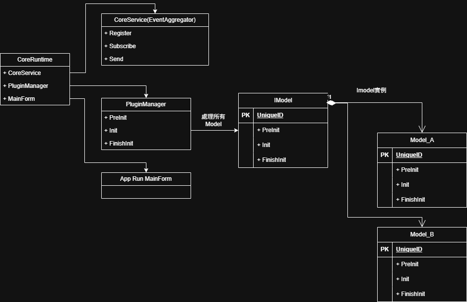
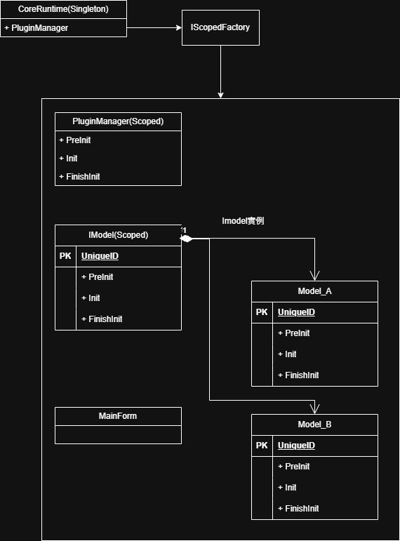

[keskeinen_Safe_Runtime_Framework]

🇺🇸 English
📖 Overview
This project demonstrates the refactoring of a legacy industrial WinForm framework (common in .NET 4.5) into a modern architecture using .NET 8/9. The primary goal is to resolve long-standing Memory Leak issues, reduce System Coupling, and enhance System Safety through a strict initialization sequence managed by Dependency Injection (DI).

🏗 Evolution of Architecture
1. Legacy Architecture (The "Event Hub" Era)
Pattern: Microkernel with a Global EventAggregator.

Communication: Components communicated via strings or types through a central CoreService for coupled interaction.

Pain Points:

Memory Leaks: Subscriptions often outlived their objects, preventing GC from reclaiming memory—a problem extremely difficult to trace in large-scale projects.

High Coupling: Every plugin was forced to depend heavily on the CoreService to function.

📈 Runtime_Framework Diagram (UML)

2. Modern Architecture (The "Scoped DI" Era)
Pattern: Dependency Injection with Isolated Scopes.

Communication: Direct Interface Injection for decoupled communication.

Key Improvements:

Automatic Disposal: All Models and the MainForm share a single Scoped lifetime. When the application closes, all resources are guaranteed to be automatically released via Dispose().

Clean Dependency: Components only depend on the interfaces they actually require, eliminating the need for a "Global Service Hub."

🛠 Key Implementation: Unique Scoped Management
Unlike standard web applications that frequently create and destroy scopes, this industrial framework maintains a Unique Scope for the entire application lifetime. This ensures state consistency across all plugins while providing a centralized mechanism to clean up all resources upon application exit.

📈 DI Diagram (UML)

📈 Results
Memory Management: Automated cleanup process effectively prevents memory residue in long-running scenarios.

Coupled Logic: Complexity and testing difficulty of adding new modules are significantly reduced through Constructor Injection.

---
🇹🇼 中文說明
📖 概述
本專案展示了如何將早期（常見於 .NET 4.5 時代）的工業級 WinForm 框架翻新至 .NET 8/9 現代架構。核心目標在於徹底解決困擾已久的記憶體洩漏 (Memory Leak) 問題、降低系統耦合度，並透過依賴注入 (DI) 管理嚴謹的初始化順序，強化系統安全性 (System Safety)。

🏗 架構演進
1. 舊有架構：事件中心化時代
模式：帶有全域事件聚合器（EventAggregator）的微核心架構。

通訊：組件間透過中央 CoreService 發送字串或型別訊息進行耦合通訊。

痛點：

記憶體洩漏：訂閱關係未正確解除導致物件無法被 GC 回收，且在大型專案中極難追蹤。

高耦合：所有插件（Plugin）都必須強依賴於 CoreService 才能運作。

📈 Runtime_Framework Diagram (UML)

2. 現代架構：Scoped DI 時代
模式：具備**隔離範圍（Scoped）**的依賴注入（DI）架構。

通訊：直接使用介面注入進行解耦。

核心改進：

自動釋放：所有 Model 與 MainForm 共享同一個 Scoped 生命週期。當應用程式關閉時，所有資源保證被自動回收（Dispose）。

乾淨依賴：組件僅需依賴其真正需要的介面，不再需要「全域轉運站」。

🛠 核心實現：唯一的 Scoped 管理
不同於標準 Web 應用頻繁建立 Scope，本工業框架為整個應用程序生命週期使用唯一的 Scope，以確保各插件間的狀態一致性，同時保有在結束時清理所有資源的能力。

📈 DI Diagram (UML)

📈 Results / 成果報告
Memory Management: 自動化清理流程，在長時間運行場景下有效防止記憶體殘留。

Coupled Logic: 透過建構子注入，新增功能模組的複雜度與測試難度大幅降低。

---
👤 Author
[keskeinen]

GitHub: @keskeinen

Focus: Industrial Software Architecture / .NET Modernization
